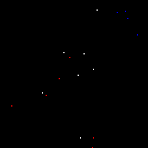

# 🟦 Pixel Life Simulation 🟩

🟥🟧🟨🟩🟦🟪🟫⬛⬜

This project is a simple simulation of a pixel population with the ability to reproduce. The pixels are represented on a 2D grid and can reproduce under certain conditions. The simulation is live and displays the population changes in a graphical window using Pygame and Matplotlib.

🟥🟧🟨🟩🟦🟪🟫⬛⬜

## 🟥Prerequisites

To run this project, the following components need to be installed:

- Python 3.10.x (USED)
- Pygame library
- Matplotlib library

## 🟧Installation

1. Clone the repository to your local machine and use:
    ```bash
      git clone https://github.com/IamSTEINI/Pixel-Life-Simulation.git
    ```
    then
    ```python
      pip install -r requirements.txt
    ```

2. Make sure **Python**, **Pygame**, and **Matplotlib** are installed.

3. Navigate to the project directory in the terminal or command prompt.

4. Run the command `python main.py` to start the simulation.

## 🟨Functionality


The Pixel Life Simulation is based on a simple algorithmic logic:

1. The grid is initialized, and the initial population is randomly placed with different DNA variants.

2. In a loop, the position of each pixel is checked to see if it can reproduce.

3. If a pixel has not reproduced yet, it searches for a vacant neighboring field in a random direction.

4. If a vacant field is found, there is a certain probability of reproduction.

5. If reproduction occurs, two offspring are generated and added to the population.

6. The grid is updated, and the simulation is redrawn in each iteration.

7. The simulation continues for a specified number of days (**DAYS**), and the population changes are displayed live in a graphical window.

8. The simulation ends when there are no more pixels that can reproduce or when the specified number of days is reached.

## 🟩Customization Options

- You can adjust the size of the grid (**GRID_SIZE**) to change the size of the map.

- The initial population (**POPULATION_SIZE**) can be modified to have more or fewer pixels.

- The speed of the simulation (**TIME_SPEED**) can be adjusted to change the speed of time (higher = slower).

- The probability of reproduction (**reproduction_probability**) can be changed to control the frequency of reproduction.

- The probability of death (**death_probability**) can be adjusted to control the likelihood of a pixel dying.

- The colors of the pixels can be customized by modifying the values in the `dna` list.
#
## 🟦Visualization

The simulation displays the changes in population and the most frequently occurring DNA in the console. Additionally, a line diagram is generated using Matplotlib, showing the frequencies of each DNA variant over time.

## 🟪License

This project is licensed under the **MIT License**. For more information, see the [LICENSE](LICENSE) file.

## 🟫Authors

This project was developed by me ( <a href="https://github.com/IamSTEINI/">**Stein**</a> ).

## 拘뜞roubleshooting

If you encounter any issues or errors while running the simulation, make sure that you have installed the required dependencies (**Python**, **Pygame**, and **Matplotlib**) and that they are up to date.

<br>


# ⬜Preview
<details>
  <summary>Images</summary>

  
  - Life


  
  - End result


  
  - Output
</details>